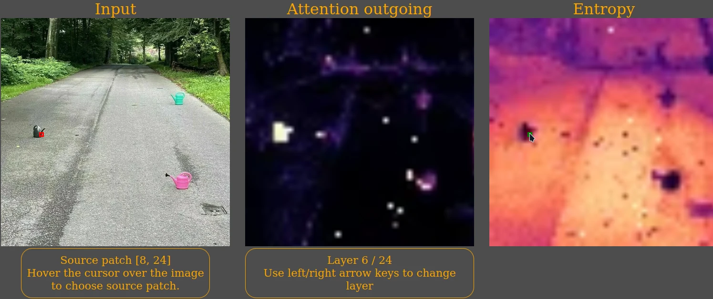

# AttEntropy: Segmenting Unknown Objects in Complex Scenes using the Spatial Attention Entropy of Semantic Segmentation Transformers

To be presented at the The [British Machine Vision Conference](https://bmvc2024.org/) (BMVC) 2024!


## Interactive Attention Visualization

Check out our interactive attention visualization at <https://liskr.net/attentropy/> !

<a href="https://liskr.net/attentropy/"></img></a>


## Local inference

```bash
pip install easydict openmim 
# mim install mmcv
# pip install mmsegmentation==0.30.0 mmpretrain
mim install --upgrade mmsegmentation mmpretrain
```

Download an example image
```bash
mkdir demo
wget https://upload.wikimedia.org/wikipedia/commons/thumb/0/01/Beeston_MMB_A6_Middle_Street.jpg/640px-Beeston_MMB_A6_Middle_Street.jpg -O demo/Beeston_MMB_A6_Middle_Street.jpg
```

Infer on the example image
```bash
python -m mtransformer.evaluation heatmaps-local --method SETR-AttnEntropy_auto12 --local-imgs demo/Beeston_MMB_A6_Middle_Street.jpg
```